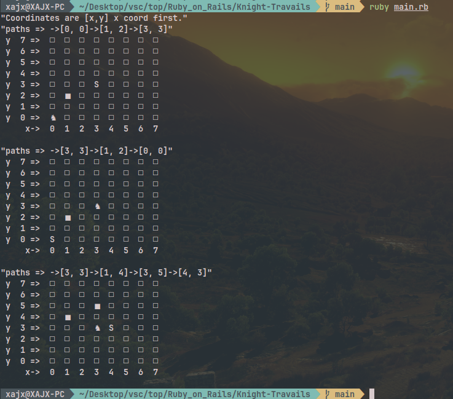

# Table of contents

<!--toc:start-->
- [Table of contents](#table-of-contents)
  - [Knight Travails](#knight-travails)
  - [📦 Structure](#structure)
  - [🛠 Features](#-features)
<!--toc:end-->

## Knight Travails

On a 8x8 chess board the knight starts at one place and finds shortest path to another.
The vertices in the graph are each of the possible positions on the chessboard,
represented by a pair of coordinates like [x, y], where x and y are
between 0 and 7, x coord first in the array.
The edges are the valid knight moves between vertices.

---

## 📦 Structure

```plaintext
├── lib
│   ├── knight_travails
│   │   ├── board.rb
│   │   ├── display.rb
│   │   ├── game.rb
│   │   └── knight.rb
│   └── knight_travails.rb
├── main.rb // just a file for testing.
└── README.md
```

---

## 🛠 Features

- `knight_moves(start,stop)` - returns the shortest path from start to
stop for the kngiht and outputs a nice display of board to showcase it.

---

## 🫣 Peek



---
